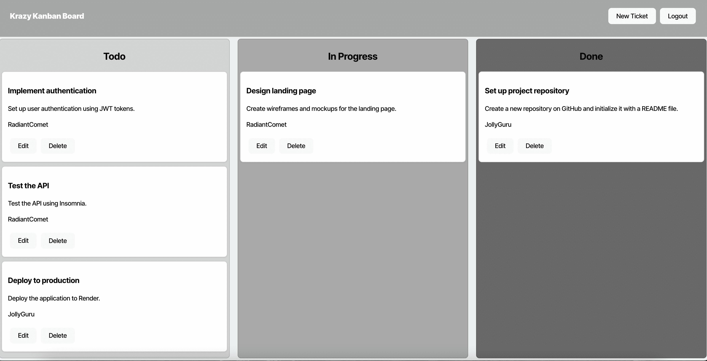
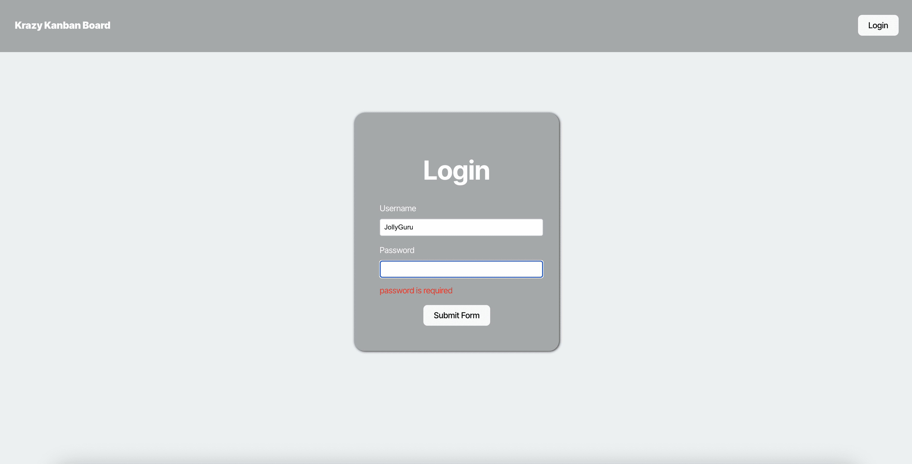
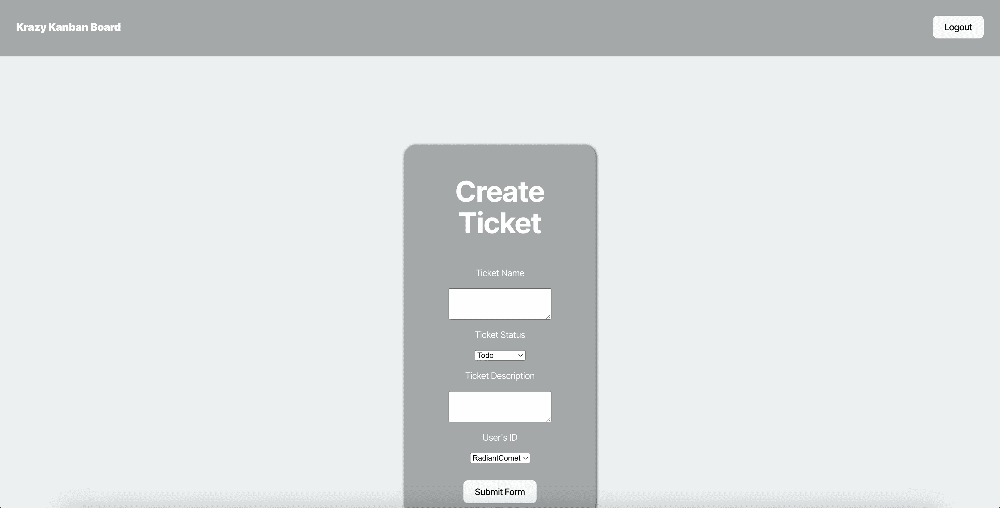

# Kanban Board

## Description

This app is a Kanban board application, designed to help users visually organize and manage tasks using a drag-and-drop interface. A Kanban board is a productivity tool that divides tasks into customizable columns, typically labeled as "To Do," "In Progress," and "Done," allowing users to track the status of their work at a glance. This app provides an intuitive way to prioritize, assign, and update tasks, making it an ideal solution for both personal and team-based project management.

## Table of Contents

-   [Usage](#usage)
-   [Contributing](#contributing)
-   [Questions](#questions)
-   [Credits](#credits)
-   [Preview](#preview)

## Usage

To use this application, simply goto [https://kanban-board-2dzw.onrender.com/](https://kanban-board-2dzw.onrender.com/)

## Contributing

Contributions are welcome. Please submit a pull request or open an issue for any feature requests or bugs.

## Questions

For any questions, please contact me on GitHub at [JaceG](https://github.com/JaceG).

## Credits

Credits: This project was created as part of a coding bootcamp group project. - Sources and References: Portions of the code and guidance were provided with assistance from ChatGPT, Tutors, and Instructors.

## Preview

